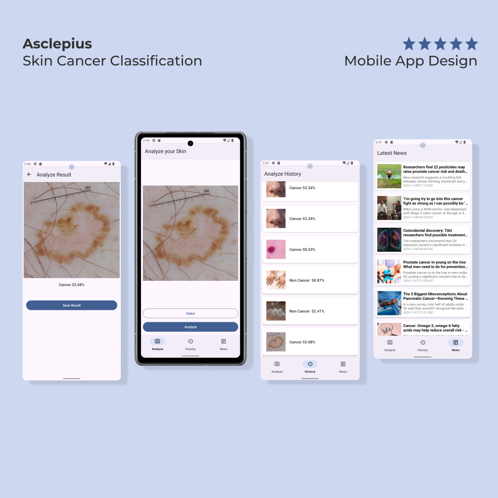

# Dicoding-MachineLearningAndroid
Repository for [Documentations Dicoding - Belajar Penerapan Machine Learning untuk Android](https://www.dicoding.com/academies/663)

## Purpose
Record Project Belajar Penerapan Machine Learning untuk Android from [Dicoding Indonesia](https://www.dicoding.com/)

## Screenshots
### Asclepius: Skin Cancer Classification

## Features
### Asclepius Submission Checklists
- [x] Using ML model from Dicoding
- [x] Using TensorFlow Lite to predict image
- [x] Implement image picker
- [x] Implement uCrop to allow crop and rotate feature before processing image
- [x] Display result page
- [x] Display history page, saving the history prediction data using local database
- [x] Display news page, showing relevant information about cancer disease from API

## Installation
- Download and install Asclepius app [here](https://github.com/e-haikal/Dicoding-MachineLearningAndroid/releases/download/v1.0.0/Asclepius_1.0.0.apk).
  
## Author
- **Asman Haikal**
